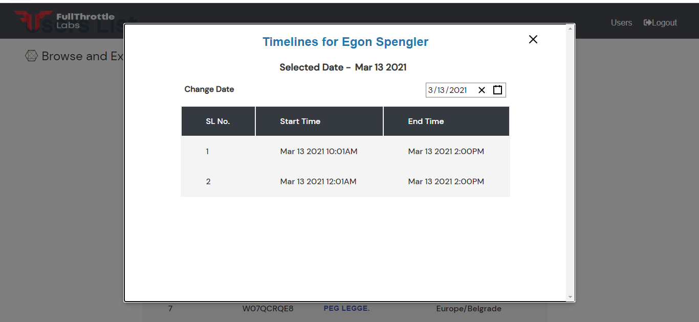
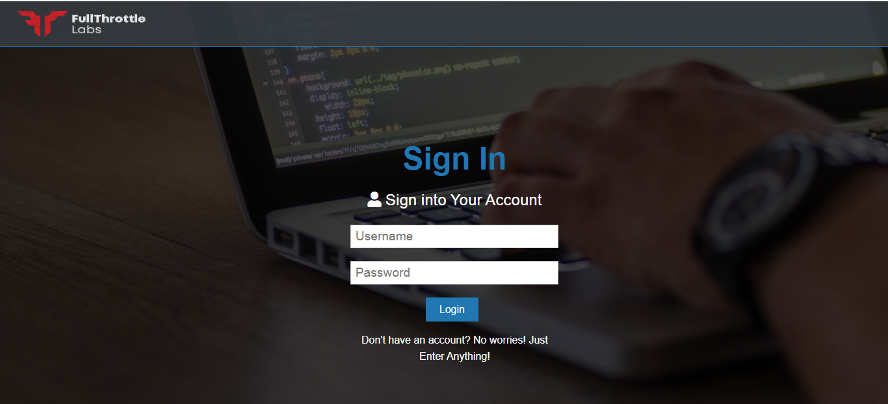

# Users App

Created for an assessment conducted by Full Throttle Labs Pvt Ltd.

# Live Demo

This project is hosted live using netlify [Users App](https://ftl-users-chandanrs.netlify.app/).

# Steps for using the app

1. Sign in is mandatory to view the users lists, just enter any values in the form and submit. 
    No checks have been implemented for now.
2. Click on the users name to view the timelines for that particular user.
3. There are about 11 users with only few dates of March 2021. Please feel free to test the application by      adding some more dates and time ranges in the JSON file named `TestData.json` if required.
4. Not much stress has been given on the responsiveness of the app since that would be an overkill for this small application.
5. I have used Material Ui and react-date-picker for improving the UI in the application.
## Available Scripts

In the project directory, you can run:

### `npm start`

Runs the app in the development mode.\
Open [http://localhost:3000](http://localhost:3000) to view it in the browser.

